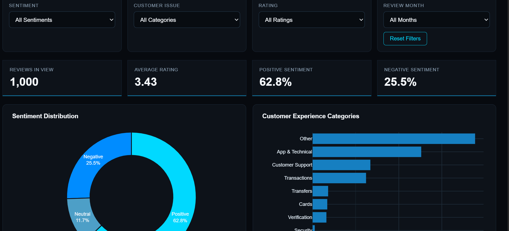

# SadaPay Customer Experience Intelligence Dashboard

An independent concept dashboard exploring how customer experience (CX) 
data such as complaints, sentiment, and satisfaction trends could be 
visualized for a fintech app like SadaPay.

**Note:** This is an unaffiliated personal project built to demonstrate 
dashboard design and frontend skills not an official SadaPay product.

## 🔗 Live Demo
[View Live Dashboard](https://samiah2004.github.io/SadaPay-Customer-Experience-Intelligence/)

## 📸 Preview

##  Problem
Fintech apps generate large volumes of customer feedback and support 
data, but teams often lack a clear visual way to track satisfaction, 
complaint trends, and churn risk signals in one place.

##  Features
- KPI cards (e.g., NPS, CSAT, complaint volume)
- Sentiment trend visualization
- Filterable data views
- Responsive design

##  Built With
- HTML5
- CSS3
- JavaScript

## How to Run
Clone the repo and open `index.html` in your browser, or view the live 
demo link above.

##  What I Learned
A short note here on what you thought about while designing it — e.g., 
which CX metrics matter, how you chose the visual layout.
